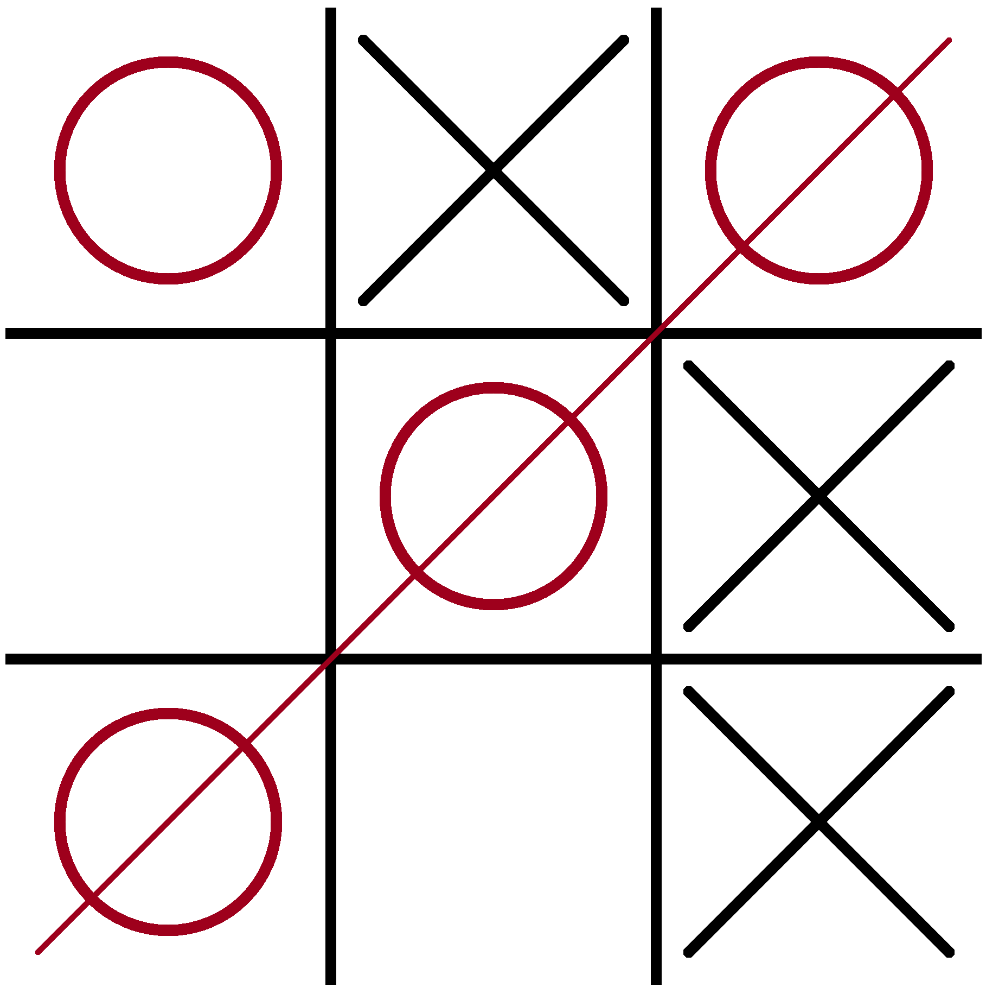

# Reproduction d'un Tic Tac Toe 

## Consigne

En vous servant des connaissances acquises, vous reproduirez le jeu du tic-tac-toe ci dessous. 

Les fonctions à utiliser sont les suivantes: 

```javascript
stroke(X)
strokeWeight(X)

line(x1, y1, x2, y2);
fill(r,g,b);
ellipse(x,y,w);
```

Vous pouvez commencer à coder en utilisant le fichier [/exercices/tic-tac-toe.js](/code/exercices/tic-tac-toe.js)
## Modèle 



